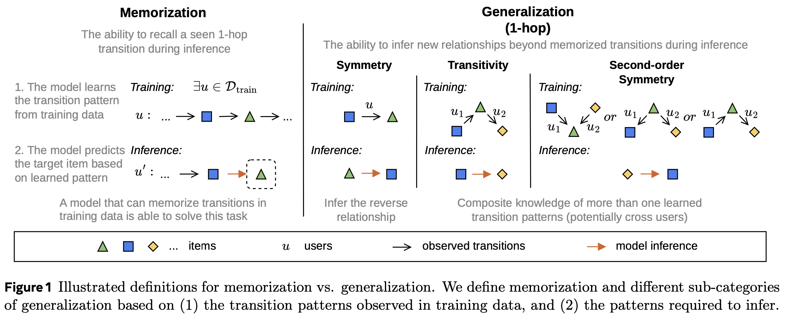

# How Well Does Generative Recommendation Generalize?

<a href="https://arxiv.org/abs/2603.19809"></a>
<a href="https://huggingface.co/datasets/jamesding0302/memgen-annotations"></a>
<a href="https://huggingface.co/jamesding0302/memgen-checkpoints"></a>

This repository provides the implementation for the paper **["How Well Does Generative Recommendation Generalize?"](https://arxiv.org/abs/2603.19809)**

In this work, we study the memorization and generalization behavior of generative recommendation (GR) models. We introduce a fine-grained evaluation framework that categorizes test instances by memorization and generalization patterns, and a token-level memorization analysis that explains why GR generalizes better but memorizes worse than conventional models. We further propose an adaptive ensemble method that leverages confidence-based indicators to combine GR and conventional models, improving overall performance.



## Resources

We release instance-level memorization/generalization **[annotations](https://huggingface.co/datasets/jamesding0302/memgen-annotations)** and saved model **[checkpoints](https://huggingface.co/jamesding0302/memgen-checkpoints)** for the 7 open-source datasets used in the paper.

## Installation

```bash
conda env create -f environment.yml
conda activate GenRec
pip install -r requirements.txt
```

## Training

Train SASRec or TIGER on a single GPU:

```bash
CUDA_VISIBLE_DEVICES=0 python main.py \
    --model=SASRec \
    --dataset=AmazonReviews2014 \
    --category=Sports_and_Outdoors
```

```bash
CUDA_VISIBLE_DEVICES=0 python main.py \
    --model=TIGER \
    --dataset=AmazonReviews2014 \
    --category=Sports_and_Outdoors
```

Multi-GPU training with accelerate:

```bash
accelerate launch --num_processes=2 --mixed_precision=fp16 main.py \
    --model=TIGER \
    --dataset=AmazonReviews2014 \
    --category=Sports_and_Outdoors
```

Training parameters can be overridden via command line (see `genrec/default.yaml` for all options).

## Evaluation

Evaluate a trained model with memorization/generalization breakdown:

```bash
CUDA_VISIBLE_DEVICES=0 python mem_gen_evaluation.py \
    --model=TIGER \
    --dataset=AmazonReviews2014 \
    --category=Sports_and_Outdoors \
    --checkpoint_path=path/to/TIGER.pth \
    --sem_ids_path=path/to/semantic_ids.sem_ids \
    --eval=test \
    --save_inference
```

To evaluate across all datasets for both models:

```bash
bash scripts/eval/eval_mem_gen.sh
```

## Analysis

Scripts under `scripts/analysis/` reproduce the analysis results in the paper. For example, to reproduce the support coverage analysis:

```bash
bash scripts/analysis/run_support_coverage.sh
```

Other analysis scripts include `run_performance_analysis.sh`, `run_codebook_intervention.sh`, `run_indicator_validation.sh`.

## Adaptive Ensemble

Run inference for both models and perform the adaptive ensemble grid search:

```bash
bash scripts/eval/eval_adaptive_ensemble.sh
```
